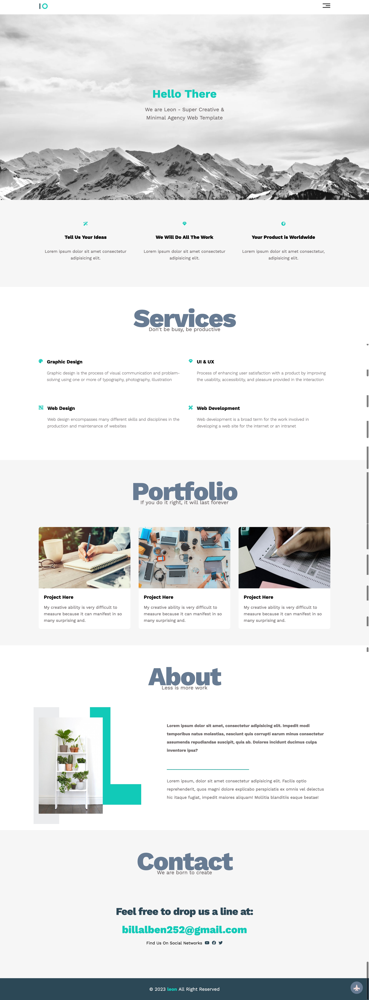

# Html Css Js Template

### Overview

[View Demo](https://billalben.github.io/html-css-template-one/)

This project is a responsive website built using HTML, CSS, and JavaScript.

This project served as a valuable learning experience.

### Screenshot

### Technologies Used

- HTML
- CSS
- JavaScript
- Font-awesome

### Acknowledgements

I would like to express my sincere gratitude to **Osama Elzero** for providing invaluable training and sharing his expertise. This project is a result of the knowledge gained from his teachings, and I want to thank him for his mentorship.
